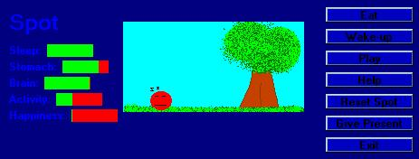



## Spot \(Virtual Pet\) v3\.5

### Description

a new version of spot... he moves around in a little meadow. he moves around the grass nole. its alot better than the earlier version and plus you can make him happy by giving him presents or playing with him. i hope you like it an please vote!

[fix 1] i fixed the bug that didnt save the happiness meter and load it again

[update 1] i made it so that spot minimizes in the sys tray so you dont have to exit the program, plus i made the main form moveable so you can place it in different places
 
### More Info
 

             |
---                |---
**Submitted On**   |2002-03-23 00:08:02
**By**             |[poop\_4\_brains](https://github.com/Planet-Source-Code/PSCIndex/blob/master/ByAuthor/poop-4-brains.md)
**Level**          |Intermediate
**User Rating**    |5.0 (15 globes from 3 users)
**Compatibility**  |VB 6\.0
**Category**       |[Games](https://github.com/Planet-Source-Code/PSCIndex/blob/master/ByCategory/games__1-38.md)
**World**          |[Visual Basic](https://github.com/Planet-Source-Code/PSCIndex/blob/master/ByWorld/visual-basic.md)
**Archive File**   |[Spot\_\(Virt646773232002\.zip](https://github.com/Planet-Source-Code/poop-4-brains-spot-virtual-pet-v3-5__1-32969/archive/master.zip)

